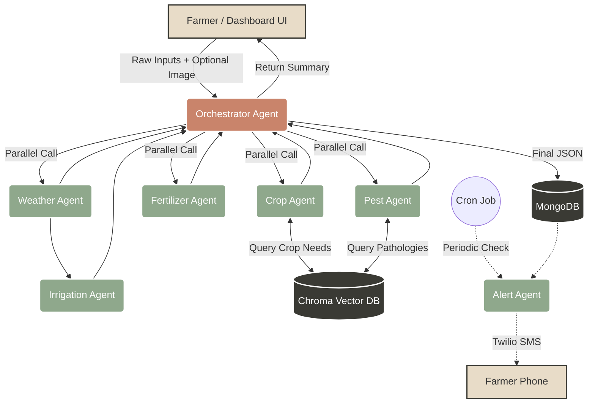

# System Flow



# Use Case Diagram

```mermaid
usecaseDiagram
    actor Farmer
    actor SystemAdmin
    
    package "AgriMind System" {
        usecase "Get Crop Suggestion" as UC1
        usecase "Get Weather Advisory" as UC2
        usecase "Get Fertilizer Plan" as UC3
        usecase "Scan for Pest" as UC4
        usecase "Get Irrigation Schedule" as UC5
        usecase "Receive SMS Alert" as UC6
        usecase "View History" as UC7
    }
    
    Farmer --> UC1
    Farmer --> UC2
    Farmer --> UC3
    Farmer --> UC4
    Farmer --> UC5
    Farmer --> UC7
    Farmer <--> UC6
    
    SystemAdmin --> UC7
```
