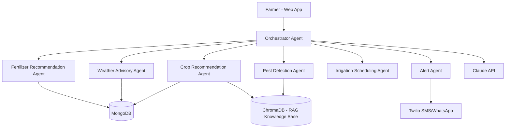

<div align="center">

# 🌾 AgriMind
### AI-Powered Multi-Agent Advisory Platform for Farmers

*Bringing 6 specialized AI agents together to help farmers make smarter decisions — from crop selection to pest control.*


</div>

---

## 🧠 What is AgriMind?

**AgriMind** is a college project built as a **multi-agent AI advisory system** for farmers, powered by the **Anthropic Claude API**. It combines large language models, retrieval-augmented generation (RAG), and real datasets to give farmers practical, data-backed guidance — all through a clean, multilingual web interface.

---

## 🤖 The 6 AI Agents

| Agent | What it does |
|---|---|
| 🌱 **Crop Recommendation Agent** | Suggests the best crops based on soil & climate data |
| ☁️ **Weather Advisory Agent** | Gives farming advice based on weather conditions |
| 🧪 **Fertilizer Recommendation Agent** | Recommends fertilizer type & quantity |
| 🐛 **Pest Detection Agent** | Analyzes uploaded pest/crop images (vision-based) |
| 💧 **Irrigation Scheduling Agent** | Plans optimal irrigation timing |
| 📲 **Alert Agent** | Sends SMS/WhatsApp notifications via Twilio |

All agents are coordinated by a central **Orchestrator Agent**, which routes farmer queries to the right specialist agent(s).

---

## ✨ Key Features

- 🗣️ **Multi-language Chatbot** — Tamil, English & Hindi support with **voice input/output** (Web Speech API)
- 📸 **Pest Detection via Image Upload** — real image analysis, not hardcoded responses
- 📐 **Agriculture Unit Converter** — land area, weight, volume, fertilizer rate & yield conversions
- 💰 **Price Calculator** — e.g. *"5kg tomato = ₹50, what's the price for 12kg?"*
- 🌗 **Light/Dark Theme Toggle**
- 🎨 **Custom Earthy Design Theme** — sage green, wheat, and terracotta color palette
- 🔍 **RAG-powered responses** using a crop/pest knowledge base stored in ChromaDB

---

## 🏗️ Tech Stack

| Layer | Technology |
|---|---|
| **LLM** | Anthropic Claude API (text + vision) |
| **Backend** | Node.js + Express |
| **Frontend** | React + Tailwind CSS |
| **Database** | MongoDB (farmer/query data) |
| **Vector Database** | ChromaDB (RAG knowledge base) |
| **Notifications** | Twilio (SMS/WhatsApp) |
| **Deployment** | Render (backend) + Vercel (frontend) |

---

## 🔀 System Flow



> 📎 A detailed **Use-Case Diagram** is available separately in [`USE_CASE_DIAGRAM.md`](./USE_CASE_DIAGRAM.md)

---

## 🎓 Academic Requirements Checklist

- ✅ AI Agents implemented in JavaScript
- ✅ Prompt engineering principles (role prompts, few-shot, structured output, RAG, guardrails)
- ✅ LLM API integration (Claude)
- ✅ Database — Vector DB (ChromaDB) + MongoDB
- ✅ Web Framework (Express/Node)
- ✅ Frontend (React + Tailwind)
- ✅ Clear flowchart & use-case diagram
- ✅ Cloud Deployment (Render + Vercel)

---

## 🚀 Live Demo

| Service | Link |
|---|---|
| 🌐 Frontend | *[add your Vercel link here once live]* |
| ⚙️ Backend API | *[add your Render link here once live]* |

---

## 🛠️ Local Setup

### Prerequisites
- Node.js (v18+)
- MongoDB Atlas connection string
- Anthropic Claude API key

### Backend
```bash
cd backend
npm install
cp .env.example .env   # add your MONGODB_URI, ANTHROPIC_API_KEY, etc.
npm start
```

### Frontend
```bash
cd frontend
npm install
npm run dev
```

---

## 📂 Project Structure

```
agrimind/
├── backend/          # Express server + AI agents
├── frontend/         # React + Tailwind UI
├── USE_CASE_DIAGRAM.md
└── README.md
```

---

## 👩‍💻 Author

Built with 💚 by **Abitha Balakrishnan**
Final Year B.Tech IT | V.S.B. Engineering College, Karur

---

<div align="center">

*Made for smarter, tech-enabled farming 🌾*

</div>
